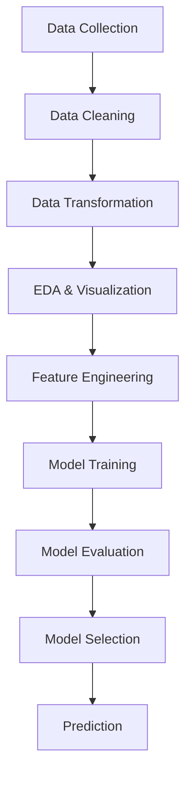

# 🚀 YouTube AdView Prediction using Machine Learning & Deep Learning

---

## 📌 Overview

This project focuses on building an **end-to-end machine learning pipeline** to predict **YouTube AdView count** using video-level metrics.

It demonstrates:

* Real-world **data preprocessing**
* Multiple **ML model implementations**
* **Deep learning (ANN)** experimentation
* Model evaluation & selection

---

## 🎯 Objective

To accurately predict **adview count** of YouTube videos using features such as:

* Views
* Likes
* Dislikes
* Comments
* Duration
* Category
* Publish time

---

## 📂 Dataset

| Feature   | Description       |
| --------- | ----------------- |
| vidid     | Unique video ID   |
| adview    | Target variable   |
| views     | Total views       |
| likes     | Likes count       |
| dislikes  | Dislikes count    |
| comment   | Comment count     |
| published | Publish timestamp |
| duration  | Video duration    |
| category  | Video category    |

---

## 🧠 Project Pipeline

---

## 🔍 Exploratory Data Analysis (EDA)

* Correlation heatmap to understand relationships between features
* Distribution plots for skewness detection
* Identified outliers and feature importance

📌 Key Observation:

* Strong correlation between **views, likes, and adview**

---

## 🧹 Data Preprocessing

* Removed missing and inconsistent values
* Converted categorical features → numerical
* Processed:

  * `published` → datetime features
  * `duration` → numeric format
* Normalized data for better model performance

---

## 🤖 Models Implemented

### 🔹 Traditional Models

* Linear Regression
* Support Vector Regressor (SVR)

### 🌳 Tree-Based Models

* Decision Tree Regressor
* Random Forest Regressor

### 🧠 Deep Learning Model

* Artificial Neural Network (ANN)

  * Multiple hidden layers
  * ReLU activation
  * Tuned epochs & learning rate

---

## 📊 Model Evaluation

| Model             | Performance               |
| ----------------- | ------------------------- |
| Linear Regression | Baseline model            |
| SVR               | Moderate performance      |
| Decision Tree     | Better non-linear capture |
| Random Forest     | Strong performance        |
| ANN (Keras)       | Best after tuning         |

📌 Metrics Used:

* MAE (Mean Absolute Error)
* MSE (Mean Squared Error)
* RMSE (Root Mean Squared Error)

---

## 📊 Model Performance Comparison

| Rank | Model | MAE ↓ | MSE ↓ | RMSE ↓ |
|------|------|------|------|-------|
| 🥇 | **Random Forest Regressor** | 3340.70 | 704,276,951.65 | **26,538.22 🔥** |
| 🥈 | Artificial Neural Network (ANN) | 3295.48 | 829,941,777.19 | 28,808.71 |
| 🥉 | Support Vector Regressor (SVR) | 1696.94 | 833,685,776.03 | 28,873.62 |
| 4️⃣ | Linear Regression | 3707.38 | 835,663,131.12 | 28,907.84 |
| 5️⃣ | Decision Tree Regressor | 2928.38 | 1,204,586,096.34 | 34,707.15 ❌ |

📌 **Best Model:** 🥇 Random Forest Regressor achieved the lowest RMSE, making it the most accurate and reliable model for predicting YouTube adview count.

📌 **Observation:** Decision Tree showed the highest error, indicating overfitting and poor generalization compared to ensemble methods.

## 🏆 Final Result

* **Best Model:** Random Forest Regressor
* Achieved improved prediction accuracy after preprocessing and tuning
* Demonstrated strong generalization on test data
* Lowest MSE

---

## 💡 Key Insights

* Feature engineering significantly impacts performance
* Tree-based models outperform linear models on non-linear data
* ANN captures complex patterns effectively
* Data normalization is crucial for deep learning

---

## 👨‍💻 Author

**Ritesh Yadav**
(Data Scientist)

---

## ⭐ Support

If you found this useful, give it a ⭐ and connect with me!
